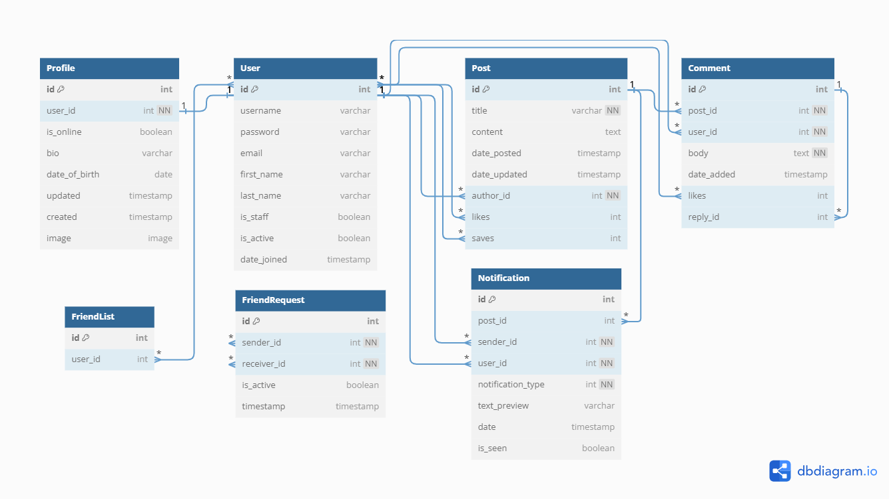

<h1 align="center">Django Social Network API</h1>
<h3 align="center">A Sample social media API app powered by RESTAPI </h3>

# Guideline

- [Guideline](#guideline)
- [Goal](#goal)
- [API endpoints](#endpoints)
- [Database Schema](#database-schema)
- [Bugs](#bugs)

# Goal

This is a sample project to show how to create a social network, and how users can CRUD posts and comments as well as
following and requesting others to be their friends. Have plans to enhance my knowledge in Django channels in future.

# Endpoints

I used djoser for authentication and other app endpoints:
# BLOG API Endpoints

| Name                             | Description                                                        | URL                                                   | Method    | Params              |
|----------------------------------|--------------------------------------------------------------------|-------------------------------------------------------|-----------|---------------------|
| Home page with all posts         | Returns all posts                                                  | **/blog/posts/**                                      | GET       |                     |
| All posts of a specific user     | Returns all posts of the specified user                            | **/blog/posts/user/<user_id>/**                       | GET       |                     |
| All of my posts                  | Returns all posts authored by the authenticated user               | **/blog/posts/mine/**                                 | GET       |                     |
| Posts of following user profiles | Returns posts from the profiles followed by the authenticated user | **/blog/posts/followings/**                           | GET       |                     |
| Post detail view                 | Returns the details of a specific post                             | **/blog/posts/<post_id>/info/**                       | GET       |                     |
| Update post                      | Updates a specific post (authenticated and post author only)       | **/blog/posts/<post_id>/**                            | PUT/PATCH | title, content      |
| Delete post                      | Deletes a specific post (authenticated and post author only)       | **/blog/posts/<post_id>/**                            | DELETE    |                     |
| Create post                      | Creates a new post                                                 | **/blog/posts/**                                      | POST      | title, content      |
| Like/unlike post                 | Likes or unlikes a specific post                                   | **/blog/posts/<post_id>/like/**                       | POST      |                     |
| Save/unsave post                 | Saves or unsaves a specific post                                   | **/blog/posts/<post_id>/save/**                       | POST      |                     |
| View post comments               | Returns all comments for a specific post                           | **/blog/posts/<post_id>/comments/**                   | GET       |                     |
| Create post comment              | Creates a new comment for a specific post                          | **/blog/posts/<post_id>/comments/**                   | POST      | comment_body, reply |
| Like/unlike post comment         | Likes or unlikes a specific comment                                | **/blog/posts/<post_id>/comments/<comment_id>/like/** | POST      |                     |
| Liked posts                      | Returns all posts liked by the authenticated user                  | **/blog/posts/liked/**                                | GET       |                     |
| Saved posts                      | Returns all posts saved by the authenticated user                  | **/blog/posts/saved/**                                | GET       |                     |
| Search posts                     | Searches posts by title or author's username                       | **/blog/posts/search/?q=<search_query>**              | GET       |                     |

**Note:** All endpoints require the user to be authenticated. Replace `<user_id>`, `<post_id>`, `<comment_id>`,
and `<search_query>` with the appropriate values when making requests.

# Database Schema

the provided schema is the main database design of the project based on the models we have used in django project.

# Bugs

Feel free to let me know if something needs to be fixed. or even any features seems to be needed in this repo.
